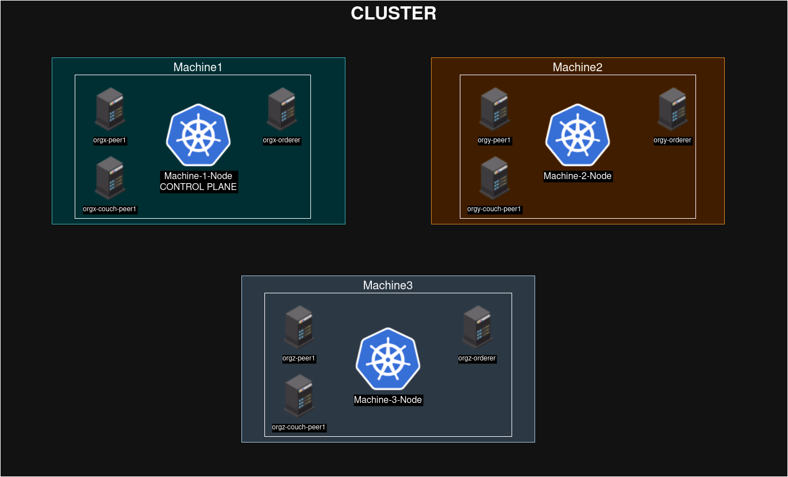

# Kubernetes Network
- This is a simple network that will be built under a on-promise kubernetes cluster
- Note that this implementation will implement a traffic load balancer
- Future interactions will make a instance load balancing horizontal scaling
- Note that with a service meshing we would be having all of the dashboards for benchmarking done but since the non kubernetes network does not have this capability we will need to use our own dashboards and use the same way to monitor (using cadvisor alongside prometheus)

## Advantages
- More Secure
- Extra layer of networking
- Better infrastructure management
- Offers Resource Definition
- Easier to manage the resources
- Built to scale
- Load Balancing over traffic is supported
- Horizontal Scaling and Vertical Scaling are supported
- Easier communication via DNS
- Easier to integrate with scripts by using jobs and also by having DNS records for each resource
- Easier to debug
- Supports service meshing wish brings even more control over the networking and already maded dashboards for monitoring the network and benchmarking of the same
- Offers high availability because it recovers from failures
- Offers high availability even in the updates with known patterns to do so (ex: Canary)
## Disadvantages
- Another abstraction layer
- More complex
- Requires attention in terms of vulnerabilities in the software
- Less light since we need to operate a lot of resources to manage the desired resources
- Expensive