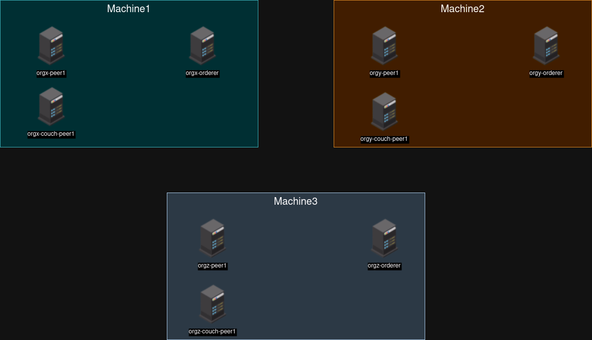

# Non kubernetes Network
- Simple network without any kind of abstraction
  

## Advantages
- More simple
- Less Components to deal
- Less complex
- Multiple failure points (if theres no load balancer involved)
## Disadvantages
- Harder to manage
- Requires more attention to network traffic
- Requires manual interventions in case of basic failures
- No Resource definition
- Automation requires scripting
- More vulnerable but at the same time less vulnerable because theres less complexity