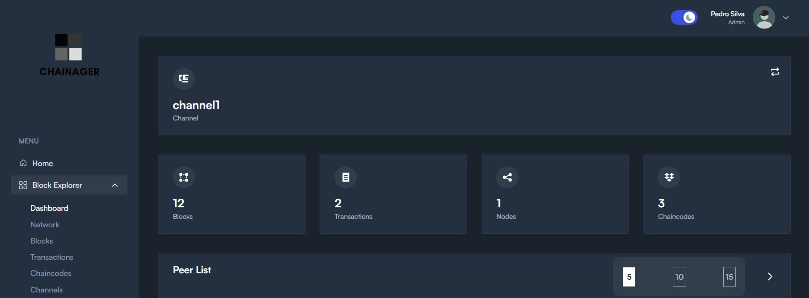
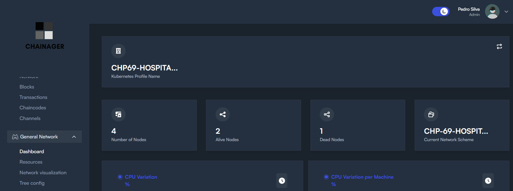
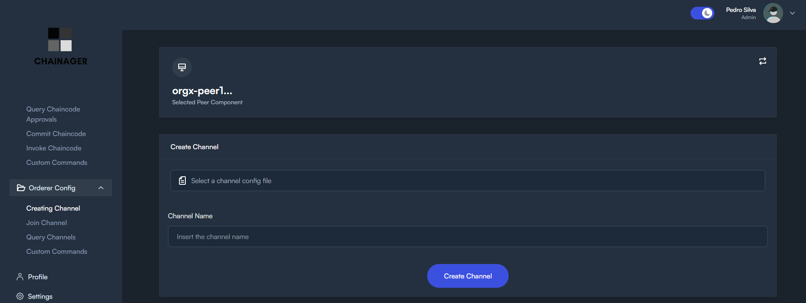

# Menus Info
## Block explorer

### Info
- This menu is to check specific hyper ledger fabric informations
- It is literally a integrated hyper ledger fabric block explorer or atleast it has the same features that you can find in the abandoned well known hyper ledger fabric block explorer
- We can change the channel under visualization in all single submenu
- We will also be able to change the kubernetes cluster under inspection (thats a future function)
### Submenus and features
- `Dashboard`
  - Global visualization of a channel info
  - Number of blocks
  - Number of transactions
  - Number of nodes
  - Number of chaincodes
  - Peers List
  - Blocks & Tx Statistics
  - Transactions by organization
  - Tree visualization of the submited blocks
- `Network`
  - Components List within a channel
  - Contains:
    - Ip address
    - Type of component
    - MSP
    - Number of transactions
    - Number of chaincodes
- `Blocks`
  - Blocks List within a channel
  - Contains:
    - Block Number
    - Channel Name
    - Data Hash
    - Block Hash
    - Number of transactions
    - Size of the block
- `Transactions`
  - Transactions List within a channel
  - Contains:
    - Creator
    - Channel Name
    - Tx id
    - Type of transaction
    - Chaincode name
    - Timestamp of transaction
- `Chaincodes`
  - Chaincodes List within a channel
  - Contains:
    - Chaincode Name
    - Channel Name
    - Number of Transactions
    - Version of chaincode
- `Channels`
  - List of channels
  - Contains:
    - Chaincode name
    - Channel name
    - Number of transactions
    - Version of channel
    - Timestamp of chaincode update
## General Network

### Info
- This menu is for having a overview of the network resources
- In the future we will be able to switch kubernetes cluster configs to view another network composures
### Submenus and features
- `Dashboard`
  - We can get the number of components
  - Alive components
  - Dead components
  - Network scheme
  - CPU variation %
  - Cpu variation per machine %
  - Disk usage per component GB
  - Disk usage per component %
  - Disk usage per machine GB
  - Disk usage per machine %
  - Ram per machine GB
  - Ram per machine %
  - Ram per component GB
  - Ram per component %
  - We can also set specific timeframes we want to check the data from
## Peer Config

### Info
- This is where we can select a peer and make configurations over it
- Here we cover every single default normal configuration and we even have a menu to issue custom commands using the peer binary
- Default configurations are: upload configs to peer,query channels,fetch channels,install chaincode,query installed chaincode,approve chaincode,query chaincode approvals,commit chaincode and invoke chaincode
- The custom commands sections is the Custom Commands 
## Orderer Config

### Info
- This is where we can make standard default operations over the network
- The default configs are: Creating a channel,Join Channel,Query channels and Custom Commands
## Future Incrementations
- New components using the UI
- Horizontal Scaling
- Cloud implementation